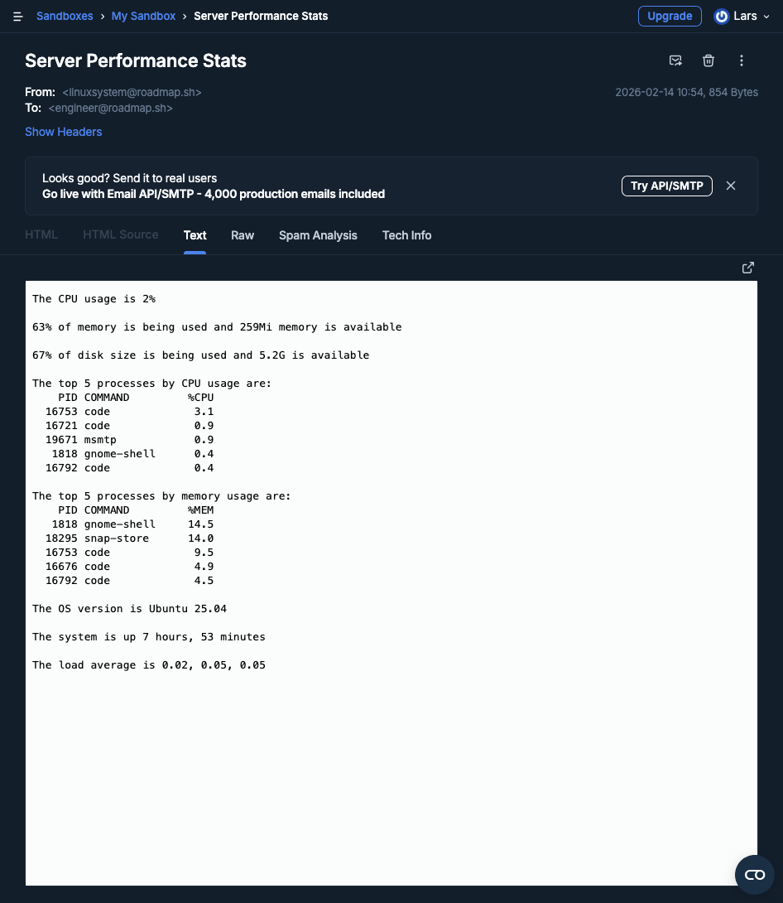

# Server Performance Stats

## Getting CPU Usage Using vmstat

- We subtract the time spent idle over a one second interval from 100 to get the CPU load in percentage
- We have to look at the id column of the `vmstat` command to see the time spent idle

```bash
$[100 - $(vmstat 1 2 | tail -1 | awk '{print $15}')]"%
```

## Getting top 5 processes by CPU usage

```bash
ps -eo pid,comm,%cpu --sort=-%cpu | head -6
```

- `-e` shows every process
- `-o` allows to output custom columns only
- `pid,comm,%pu` grabs only the three specified columns

## Personal challenge: Send an email of the stats every hour

A system usually pushes an alert to a monitoring tool if there was an event.
However, for this project, I'm simply going to use a cronjob to send the stats once every hour to the DevOps engineer's inbox.

### Install `msmtp`

```bash
sudo apt install msmtp
```

### Configure `~/.msmtprc`

```bash
defaults
tls on

account mailtrap
auth on
host sandbox.smtp.mailtrap.io
port 587
user ********
password ********
from linuxsystem@roadmap.sh

account default : mailtrap
```

- I ueed Mailtrap Sandbox for email testing

### Cron job

```bash
0 * * * * cd $HOME/projects/devops-roadmap/server-performance-stats && { echo "To: engineer@roadmap.sh"; echo "Subject: Server Performance Stats"; echo; ./server-stats.sh; } | msmtp -t
```

- This sends an email once every hour

### Command group

```bash
{ 
    echo "To: engineer@roadmap.sh"; 
    echo "Subject: Server Performance Stats"; 
    echo; ./server-stats.sh; 
} | msmtp -t
```

- HereDoc didn't work in the cron jobs so I used a command group

### The email message




## Resources

[Getting CPU Usage Using vmstat](https://www.baeldung.com/linux/get-cpu-usage#1-getting-cpu-usage-using-vmstat)
[How do I check the version of Ubuntu I am running?](https://askubuntu.com/questions/686239/how-do-i-check-the-version-of-ubuntu-i-am-running)
[Send emails from your terminal with msmtp](https://arnaudr.io/2020/08/24/send-emails-from-your-terminal-with-msmtp/)
